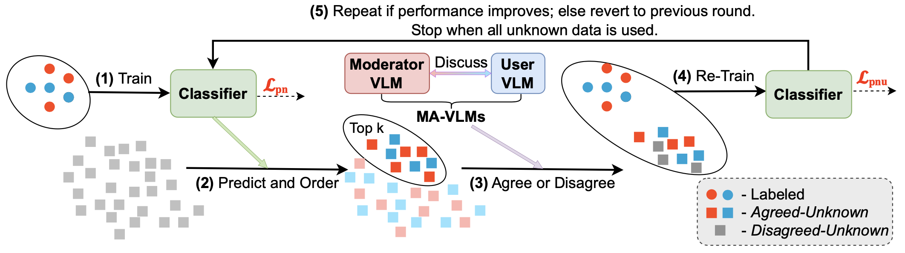
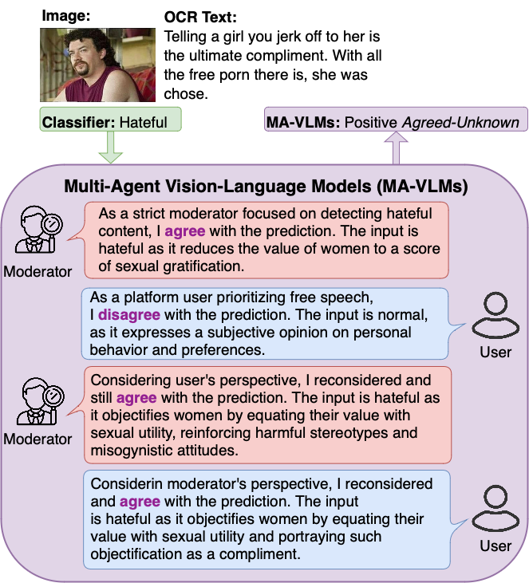
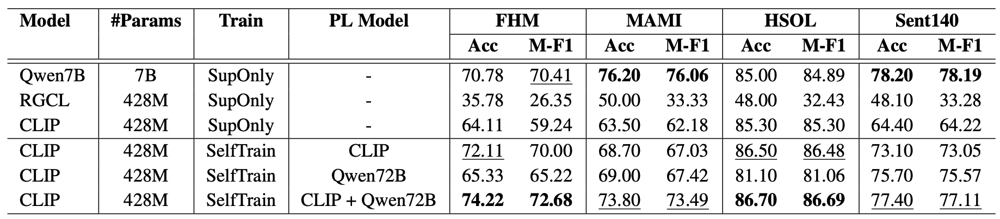
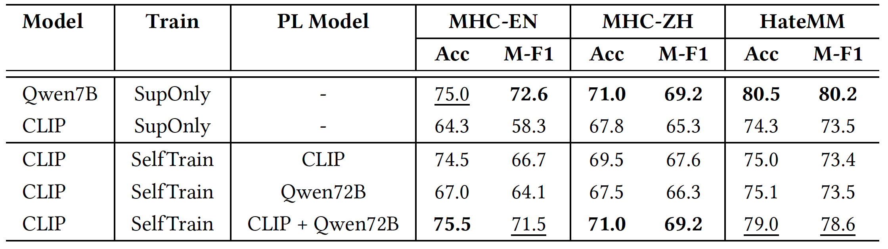

# Official Code Repository for the Paper: **Multi-Agent VLMs Guided Self-Training with PNU Loss for Low-Resource Offensive Content Detection**

## Introduction

This work addresses the challenge of low-resource offensive content detection by introducing an iterative self-training pipeline that leverages Multi-Agent Vision-Language Models (MA-VLMs) and a novel Positive-Negative-Unlabeled (PNU) loss function. The goal is to enhance model performance using a small labeled subset and a larger pool of unlabeled data.

### MA-VLMs-Based Self-Training Pipeline

The proposed pipeline employs a self-training strategy, where a lightweight classifier is initially trained on labeled data and then progressively incorporates pseudo-labeled samples. Pseudo labels are generated by the classifier and refined through the use of MA-VLMs. The classifier is optimized using the PNU loss, which handles both labeled and pseudo-labeled data.


*Figure 1: MA-VLMs-guided self-training pipeline using PNU loss.*

### Multi-Agent Vision-Language Models (MA-VLMs)

To simulate content auditing, where an auditor and a user collaborate to assess content, we introduce a framework based on MA-VLMs. This framework involves two agents: a strict auditor focused on detecting hate speech and a lenient user advocating for free expression. Each agent generates an initial decision and rationale, reviews the counterpart’s judgment, and issues a final revised decision. Pseudo-labels are assigned based on agent alignment: *Agreed-Unknown* when both agents agree, and *Disagreed-Unknown* otherwise.


*Figure 2: MA-VLMs framework for hate meme detection.*

### Positive-Negative-Unlabeled (PNU) Loss

To leverage both labeled and unlabeled data effectively, we propose the **PNU loss**, which incorporates labeled, *Agreed-Unknown*, and *Disagreed-Unknown* samples. The loss function is defined as:

$$
\mathcal{L}_{\text{pnu}} = 
\begin{cases}
(1 - \gamma) \cdot (\mathcal{L}_{\text{pn}} + \mathcal{L}_{\text{soft-pn}}) + \gamma \cdot \mathcal{L}_{\text{pu}}, & \text{if } \gamma \geq 0 \\
(1 + \gamma) \cdot (\mathcal{L}_{\text{pn}} + \mathcal{L}_{\text{soft-pn}}) - \gamma \cdot \mathcal{L}_{\text{nu}}, & \text{if } \gamma < 0
\end{cases}
$$

Where $\gamma \in \[-1, 1]$ is adaptively selected based on the dataset’s characteristics. The value of $\gamma$ controls the balance between Positive-Negative (PN), Positive-Unlabeled (PU), and Negative-Unlabeled (NU) learning.

## Experimental Results

Our experiments demonstrate the effectiveness of the MA-VLMs framework, the classifier's prediction verification through MA-VLMs, and the PNU loss. The lightweight classifier, trained with our self-training pipeline, significantly outperforms the supervised-only method and achieves performance comparable to larger models, particularly in low-resource settings, as illustrated in the figure. This approach facilitates scalable and high-quality content moderation.


*Figure 3: Comparison of models and training strategies across four datasets (n = 100). PL Model = Pseudo-labeling model.*


*Figure 4: Evalutation of models on low-resource hate video datasets (n = 100). PL Model = Pseudo-labeling model.*

## Code Setup

### Installation

1. **Install the required dependencies:**
    ```bash
    pip install -r requirements.txt
    ```

### Data Preparation

1. **Dataset Format:**
   Ensure your dataset follows the structure in `datasets/demo_dataset`, including the files `all.jsonl`, `train.jsonl`, `dev.jsonl`, and `test.jsonl`. We support binary input data, with Label = 1 indicating Positive and Label = 0 indicating Negative.


2. **Splitting Data into Known and Unknown:**
   Use the following command to split your dataset into known and unknown data, specifying the number of known samples (e.g., 50, 100, or 250).

   ```bash
   python ./datasets/known_unknown_split.py --root_folder path_to_root --dataset_name FHM
   ```

3. **Running MA-VLMs Inference:**
   To generate MA-VLM outputs in a single step (providing responses for both Positive and Negative classifier predictions), run:

   ```bash
   python ./scripts/MA_VLMs_inference.py --root_folder path_to_root --dataset_name FHM --model_id Qwen/Qwen2.5-VL-72B-Instruct
   ```

   If you wish to use other datasets (excluding FHM, MAMI, HSOL, and Sent140), please adapt the prompt format accordingly for your specific use case.

### Iterative Training

Run the iterative training process with the following command, which includes multiple rounds of training, classifier inference, and pseudo-label generation. You can tune parameters such as the number of labeled data (n), the number of pseudo-labels per round (k), gamma, pi_p, pos_unknown_value and neg_unknown_value in the PNU loss, the pseudo-label modeling method (classifier, MA-VLMs, or their combination).

```bash
python ./scripts/experiments.py --root_folder path_to_root --known_number 100 --dataset_name FHM --topk 500 --gamma 0.1 --pi_p 0.5 --pos_unknown_value 0.67 --neg_unknown_value 0.33 --pseudo_label_type classifier_ma_vlm --epochs 10 --model_id openai/clip-vit-large-patch14
```

We provide a demo dataset with 1000 data samples including input files (`./datasets/demo_dataset`), metadata (`./scripts/meta_data`), and training results (`./scripts/running_results.log`) for inference.


